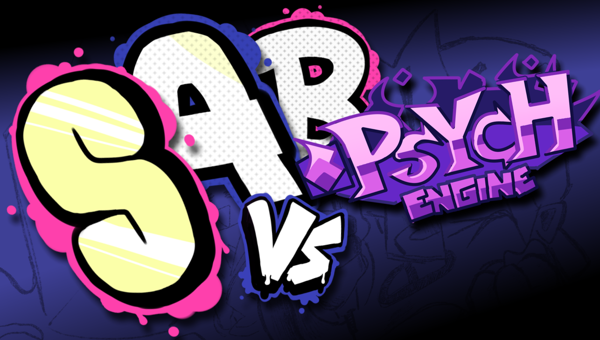

# ONLINE VS. Result Screen for Psych Engine

This is a psych engine re-creation of the result screen from [ONLINE VS](https://gamebanana.com/mods/286594).

You can use it as a mod for psych engine to add the result screen to the game, use the mod's settings to determine when it will appear and use its signals with the `triggerEvent` function to add a custom unlock screen to your mod and make it more compatible with this result screen. If you want, you can also hold the `space` key or any of the note keys to speed up the result screen's animations.

# Settings

* **Only when triggered** - Makes the result screen display only when another mod triggers it using the `Signal-Trigger OVS Results` event.
* **Only on freeplay** - Makes the result screen display only on freeplay.

# Signals

* `Signal-Trigger OVS Results` - Lets a mod trigger the result screen explicitly. Should be called with `triggerEvent` before the `onEndSong` callback.
    * Value 1 - The amount of calls to `onEndSong` the result screen should skip out on. Useful for adding a cutscene before the result screen.
    * Value 2 - Ignored.
* `Signal-Add Unlocked Screen` - Lets a mod add its own unlock screen after the result screen is over. The mod should create two lua sprites and pass their tags through this event. Should be called with `triggerEvent` before the `onEndSong` callback.
    * Value 1 - The tag of the main lua sprite, which will appear in the middle of the screen. If the tag is invalid, the unlock screen will not appear.
    * Value 2 - The tag of the secondary sprite, which will appear in the bottom-right corner of the screen after the main sprite gets to the middle of the screen. If the tag is invalid, only the main sprite will appear and will be covered in black until it gets to the middle of the screen.
> [!TIP]
> If the sprites don't end up appearing were you wanted them to appear on the screen, you can adjust the `offset.x` and `offset.y` values of the sprites before they are used in the unlock screen to move them relative to the position on the screen where they ended up.
* `Signal-Set Unlocked Screen Color` - Lets you set the background color of the unlock screen using a HEX color code. Should be called with `triggerEvent` before the `onEndSong` callback.
    * Value 1 - The HEX color code of the background color of the unlock screen. The format should be either `#RRGGBB` or `0xRRGGBB`.
    * Value 2 - Ignored.

# Credits

* TheBlueHatted - Original Programmer & Additional Assets
* FifLeo - Lead Artist
* AppleHair - Psych Engine Port Coder
